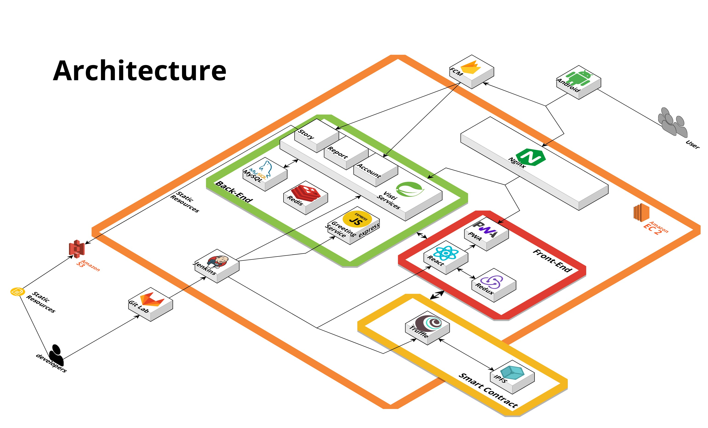
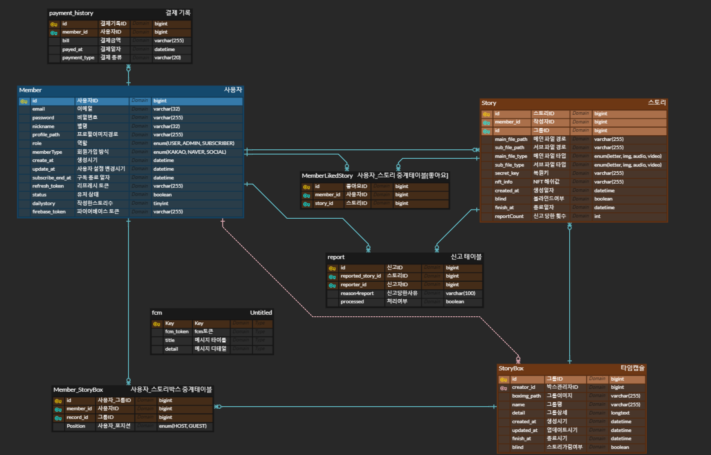

 
 
 

# 서비스 소개

추억을 NFT화시키고 친한사람들끼리 추억을 공유할 수 있는 sns 서비스

[비스티 바로가기](https://visti-story.com/storybox)<앱 배포중>

 
 
 

# 프로젝트 소개

1차. 23.08.14 ~ 23.10.06 (6주)  
2차. 23.12.14 ~    (진행중)

총 6명 (프론트 2 / 백 2 / 모바일 2)

 
 
 

# 개발 환경

**FE** | `React` `Redux`  `TypeScript`  `PWA`

**BE** | `Redis` `MySQL` `S3`

**Mobile** | `Android` `Jetpack Compose`

**BE - API** | `Java` `SpringBoot` `JPA` `SpringSecurity` `Swagger` `Postman`

**BE - Mobile** | `FireBaseCloud`

**CI/CD** | `AWS` `EC2` `Docker` `Jenkins` `Nginx`

 
 
 

# 주요 화면

|                                                                                                           |                                                                                                           |
| --------------------------------------------------------------------------------------------------------- | --------------------------------------------------------------------------------------------------------- |
|  |  |
| `메인 화면`                                                                                               | `스토리 박스생성`                                                                                         |
|  |  |
| `스토리 생성`                                                                              | `좋아요 페이지`                                                           |

 
 
 

# 아키텍처

 
 
 

# ERD

 
 
 

# 와이어 프레임

 
 
 

